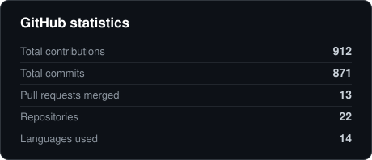
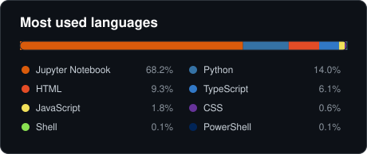
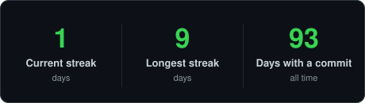
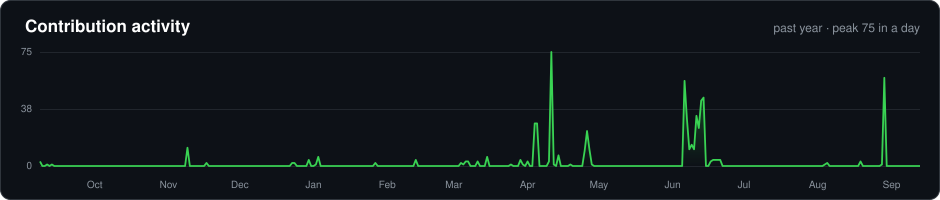

<!--
  ============================================================================
  ParshvCrafts - GitHub Profile README
  ----------------------------------------------------------------------------
  Two colour families, used for different jobs:
    Blue   #0a66c2 / #2f81f7 / #58a6ff   waves, typing banner, snake
    Green  #39d353 / #26a641 / #006d32   contribution data ONLY
    Indigo #4f46e5 / #6366f1 / #818cf8   credential badges and Portfolio
  Green is reserved for things that represent real contribution activity, so
  the page does not read as one flat wash of it.

  Rules this file follows:
    1. Every coloured card ships a light AND a dark variant through <picture>
       + prefers-color-scheme, because GitHub renders READMEs in both.
    2. Tech is logos only. The strips are built by scripts/techstack.py and
       committed: go-skill-icons returns nested <svg> elements and GitHub's
       image proxy strips them, which left only the first icon of each row.
    3. No em dashes anywhere in the prose.
    4. Body copy is set with <h3>/<h4> and short lines rather than paragraphs.
       GitHub strips style attributes, so heading level is the only real
       control over text size; keeping the text short is the other half.
  ============================================================================
-->

<div align="center">


<a href="https://www.portfolio.parshvpatel.com/">
  
</a>

<br>

<a href="https://www.linkedin.com/in/parshv-patel-65a90326b/"></a>
<a href="mailto:parshvpatel_0910@berkeley.edu"></a>
<a href="https://www.portfolio.parshvpatel.com/"></a>
<a href="https://github.com/ParshvCrafts?tab=repositories"></a>

<br><br>


</div>

---

## About

### I build systems that turn messy data into decisions, and agents that act on them.

**Data Science at UC Berkeley**, 4.00 GPA, Dean's List every term.
**Software Engineer Intern at Amazon** last summer: redesigned config resolution for a batch ML inference platform, shipped live, zero incidents.

I work where **data engineering, machine learning and agentic AI** meet. Retrieval over 29K products. Multi-agent LangGraph workflows running as a paid product. ETL over 15M+ records. Fine-tuned transformers behind production APIs.

What I care about is the unglamorous half: schema design, failover paths, evaluation, and the tests that let you ship on a Friday.

> ### Open to Summer 2027 internships
> Data Science &middot; Data Engineering &middot; Machine Learning &middot; AI and Agentic Engineering

---

## Experience

### Software Engineer Intern &nbsp;&middot;&nbsp; Amazon

#### Classification and Policy Platforms &nbsp;&middot;&nbsp; Seattle &nbsp;&middot;&nbsp; Summer 2026

Redesigned how a batch ML inference platform resolves model configuration, then migrated it live behind a fallback architecture so no customer saw the switch.

- Merged **5 model configuration stores into 2 schemas** and removed **20+ hardcoded service dependencies**. Model onboarding went from weeks to hours.
- Built a fallback path across **3 distributed service layers** so the live migration could not take the platform down.

<div align="center">

| Changes merged | Lines added | Packages shipped | Incidents |
| :------------: | :---------: | :--------------: | :-------: |
| **44** | **61,565** | **19** | **0** |

</div>

---

## Featured Projects

### Six projects. Open one for the stack, the numbers, and the decision that mattered.

<details open>
<summary><h3>&nbsp;Interlace &nbsp;&middot;&nbsp; Multimodal Fashion Search Engine</h3></summary>

Search **29,000+ ASOS products** by text, image, or both at once. Fashion-tuned CLIP embeddings feed two FAISS indexes, fused with keyword search, so *"like this jacket but in linen"* matches the picture and the words.

| | |
| :--- | :--- |
| **Stack** | Python &middot; FashionCLIP &middot; FAISS &middot; BM25 &middot; FastAPI &middot; Next.js &middot; Docker |
| **Scale** | 29,000+ products, two vector indexes, text / image / combined queries |
| **Search** | Vector and keyword results merged by Reciprocal Rank Fusion, then reranked on parsed intent |
| **Links** | [Repository](https://github.com/ParshvCrafts/Multimodal_Search_Engine) &middot; [Live Demo](https://interlace-fashion.vercel.app/) &middot; [Video](https://www.youtube.com/watch?v=1bLxOZ0QqVs) |

**Why it works:** no single method handles real shopper queries. Vector search misses exact brand and size words; keyword search misses visual intent. Running both and merging is what made results usable rather than merely relevant.

</details>

<details>
<summary><h3>&nbsp;AtlasMind &nbsp;&middot;&nbsp; Agentic AI Trip Planner</h3></summary>

A paid AI travel platform where **six LangGraph agents** research, draft, critique and finalise an itinerary. Requests route across 10 LLM keys with health scoring, so one provider going down never reaches a paying user.

| | |
| :--- | :--- |
| **Stack** | Python &middot; FastAPI &middot; LangGraph &middot; React &middot; PostgreSQL &middot; Stripe |
| **Scale** | 6-agent state machine, routing across 10 keys, 99.9% uptime |
| **Product** | Stripe Free / Pro tiers, usage tracking, webhooks, quota enforcement |
| **Links** | [Repository](https://github.com/ParshvCrafts/AtlasMind) &middot; [Live Demo](https://atlasmind-ai-trip-planner.vercel.app/) &middot; [Video](https://youtu.be/WWb9e_y1B40) |

**Why it works:** agent demos are easy, agent products are not. The engineering went into what users never see: quota enforcement that survives a replayed webhook, routing that degrades instead of failing, and a critic agent that catches a bad generation before a customer does.

</details>

<details>
<summary><h3>&nbsp;Vendor Performance Analysis &nbsp;&middot;&nbsp; Retail Analytics at Scale</h3></summary>

An ETL and analytics pipeline over **15.6M+ transaction records**, built to answer a question the business could not previously ask: which vendors quietly tie up working capital?

| | |
| :--- | :--- |
| **Stack** | Python &middot; SQL &middot; Pandas &middot; Power BI |
| **Speed** | Query time cut from **9 minutes to 44 seconds**, roughly 12x |
| **Finding** | **$3.7M** of unsold inventory capital held by underperforming vendors |
| **Links** | [Repository](https://github.com/ParshvCrafts/Vendor-Performance-Analysis) |

**Why it works:** the 12x mattered more than it sounds. At nine minutes a query, analysts asked one question a day. At forty-four seconds, they explored.

</details>

<details>
<summary><h3>&nbsp;AI Text Summarizer &nbsp;&middot;&nbsp; Fine-Tuned FLAN-T5</h3></summary>

Dialogue summarisation on **FLAN-T5 fine-tuned over 16,000+ SAMSum conversations**, using a PyTorch training loop written from scratch with mixed precision and resumable checkpoints.

| | |
| :--- | :--- |
| **Stack** | Python &middot; PyTorch &middot; FLAN-T5 &middot; FastAPI &middot; Groq &middot; React |
| **Quality** | **ROUGE-1 = 43.53**, sub-second inference, 35 tests passing |
| **Links** | [Repository](https://github.com/ParshvCrafts/Text-Summarizer) &middot; [Live Demo](https://text-summarizer-lilac.vercel.app/) &middot; [Video](https://youtu.be/RNVwHcDpYfc) |

**Why it works:** writing the loop by hand instead of using a prebuilt `Trainer` was the point. Checkpoint resumption and profile switching break when you cannot see the loop, and they are what let the model train on free compute that can be interrupted.

</details>

<details>
<summary><h3>&nbsp;SpaceX Falcon 9 Landing Predictor</h3></summary>

Predicts whether a Falcon 9 first stage lands successfully, then turns that into launch-cost economics. Collection, cleaning, exploration, mapping and modelling end to end.

| | |
| :--- | :--- |
| **Stack** | Python &middot; Pandas &middot; scikit-learn &middot; Folium &middot; Plotly Dash |
| **Result** | **94.4%** accuracy, SVM selected from 4 classifiers under GridSearchCV |
| **Impact** | Quantified a **$103M** cost difference per launch based on stage recovery |
| **Links** | [Repository](https://github.com/ParshvCrafts/SpaceX-Landing-Predictor) |

**Why it works:** the modelling was the short part. The value came from reconciling an inconsistent public API against scraped launch tables, which is where the real errors lived.

</details>

<details>
<summary><h3>&nbsp;CFD Navier-Stokes Solver</h3></summary>

A 2D fluid-dynamics solver written from first principles for UC Berkeley Physics 77, used to sweep airfoil shapes for the best lift-to-drag ratio.

| | |
| :--- | :--- |
| **Stack** | Python &middot; NumPy &middot; finite-difference methods |
| **Result** | Best **lift-to-drag = 1.479**, NACA 5315 at 0.1 m/s |
| **Recognition** | **Charlene Conrad Liebau Library Prize, Honorable Mention.** The only STEM paper among lower-division finalists from 51 applicants |
| **Links** | [Repository](https://github.com/ParshvCrafts/CFD_Navier-Stokes_Solver) |

**Why it works:** implementing the pressure coupling by hand rather than calling a solver library is why this one is here. It is where numerical stability stopped being a debugging problem and became a design constraint.

</details>

---

## Tech Stack

<div align="center">

### Languages

<picture>
  <source media="(prefers-color-scheme: dark)"  srcset="assets/stack-languages-dark.svg">
  <source media="(prefers-color-scheme: light)" srcset="assets/stack-languages-light.svg">
  
</picture>

### Machine Learning and AI

<picture>
  <source media="(prefers-color-scheme: dark)"  srcset="assets/stack-ml-dark.svg">
  <source media="(prefers-color-scheme: light)" srcset="assets/stack-ml-light.svg">
  
</picture>

### Data and Analytics

<picture>
  <source media="(prefers-color-scheme: dark)"  srcset="assets/stack-data-dark.svg">
  <source media="(prefers-color-scheme: light)" srcset="assets/stack-data-light.svg">
  
</picture>

### Backend, Cloud and Tooling

<picture>
  <source media="(prefers-color-scheme: dark)"  srcset="assets/stack-tooling-dark.svg">
  <source media="(prefers-color-scheme: light)" srcset="assets/stack-tooling-light.svg">
  
</picture>

</div>

---

## What I Can Actually Do

### Every row names the system that proves it.

| Area | Level | Evidence |
| :--- | :--- | :--- |
| **Agentic AI and multi-agent systems** | Production | 6-agent LangGraph workflow serving paying users, failover across 10 providers |
| **Search and retrieval (RAG)** | Production | Vector plus keyword retrieval over 29K products, two FAISS indexes fused by rank fusion |
| **Fine-tuning transformers** | Proficient | FLAN-T5 on 16K dialogues, hand-written fp16 loop, ROUGE-1 43.53 |
| **Classical ML and model selection** | Proficient | GridSearchCV across SVM, Random Forest and CNN; 94.4% and 99% on two problems |
| **Data engineering and ETL** | Proficient | 15.6M-record pipeline, 12x query-time cut, production schema work at Amazon |
| **Deployment and MLOps** | Working | Dockerised services on HuggingFace, Vercel, Render and Railway; full test suites |

---

## Achievements

<div align="center">

| Recognition | What it is |
| :--- | :--- |
| **4.00 GPA, Dean's List &times;2** | UC Berkeley, B.A. Data Science, every graded term |
| **Amazon Future Engineer Scholar** | National scholarship that includes the Amazon internship |
| **Greenhouse Scholar** | Whole College Program, selected at a 1-in-1,780 rate |
| **RSM US Foundation First Generation Scholar** | 2026 cohort, 1 of 5 nationwide |
| **Charlene Conrad Liebau Library Prize** | Honorable Mention, only STEM paper among lower-division finalists from 51 |
| **Valedictorian** | Ranked #1 of 455, AP Scholar with Distinction |

</div>

<details>
<summary><b>&nbsp;Seven more honours and fellowships</b></summary>

<br>

| Recognition | What it is |
| :--- | :--- |
| **MLT Ascend Scholar** | Management Leadership for Tomorrow career fellowship |
| **AI4ALL Ignite Fellow** | Applied AI accelerator for underrepresented technologists |
| **CAA Leadership Scholar** | Cal Alumni Association multi-year leadership award |
| **QuestBridge National College Match Finalist** | Also a College Prep Scholar |
| **Berkeley competitive prizes** | Leslie Lipson &middot; Elizabeth Mills Crothers &middot; Dorothy Rosenberg &middot; Lili Fabilli and Eric Hoffer |
| **IMO Gold Medal** | International Mathematics Olympiad, Level 1 |
| **GFWC National 1st Place** | National youth writing competition |

</details>

---

## Certifications

<div align="center">

<!-- Only the three Coursera credentials have a public verification URL I could
     confirm resolves to Parshv's own certificate. The rest point at the LinkedIn
     certifications page, where each one opens directly. -->

| Certification | Issuer | Issued | Credential |
| :--- | :--- | :---: | :---: |
| **AWS Certified AI Practitioner** | Amazon Web Services | Aug 2026 | [view](https://www.linkedin.com/in/parshv-patel-65a90326b/details/certifications/) |
| **Foundations of AI Engineering**, Honors | CodePath | May 2026 | [view](https://www.linkedin.com/in/parshv-patel-65a90326b/details/certifications/) |
| **Berkeley Student Leadership Academy** | UC Berkeley | Apr 2026 | [view](https://www.linkedin.com/in/parshv-patel-65a90326b/details/certifications/) |
| **Berkeley Changemaker** | UC Berkeley | Dec 2025 | [view](https://www.linkedin.com/in/parshv-patel-65a90326b/details/certifications/) |
| **Deloitte Australia Data Analytics** | Forage | Jul 2025 | [view](https://www.linkedin.com/in/parshv-patel-65a90326b/details/certifications/) |
| **Commonwealth Bank Data Science** | Forage | Jul 2025 | [view](https://www.linkedin.com/in/parshv-patel-65a90326b/details/certifications/) |
| **Introduction to Data Analytics** | IBM | Feb 2025 | [verify](https://www.coursera.org/account/accomplishments/verify/LP6HDSNQ1Y6T) |
| **SQL for Data Science** | UC Davis | Feb 2024 | [verify](https://www.coursera.org/account/accomplishments/verify/V25JNXZB8UAB) |
| **Python for Everybody**, Specialization | University of Michigan | Dec 2023 | [verify](https://www.coursera.org/account/accomplishments/specialization/Z7L2ZZKMTKTH) |

<br>

<a href="https://www.linkedin.com/in/parshv-patel-65a90326b/details/certifications/"></a>

</div>

---

## GitHub Activity

<div align="center">

<!-- Generated in this repository by scripts/cards.py, refreshed twice a day by
     .github/workflows/cards.yml. They used to come from the shared public
     github-readme-stats and streak-stats instances, which went down. -->

<picture>
  <source media="(prefers-color-scheme: dark)"  srcset="assets/card-stats-dark.svg">
  <source media="(prefers-color-scheme: light)" srcset="assets/card-stats-light.svg">
  
</picture>
<picture>
  <source media="(prefers-color-scheme: dark)"  srcset="assets/card-langs-dark.svg">
  <source media="(prefers-color-scheme: light)" srcset="assets/card-langs-light.svg">
  
</picture>

<br>

<picture>
  <source media="(prefers-color-scheme: dark)"  srcset="assets/card-streak-dark.svg">
  <source media="(prefers-color-scheme: light)" srcset="assets/card-streak-light.svg">
  
</picture>

<br><br>

<picture>
  <source media="(prefers-color-scheme: dark)"  srcset="assets/card-activity-dark.svg">
  <source media="(prefers-color-scheme: light)" srcset="assets/card-activity-light.svg">
  
</picture>

<br><br>

<picture>
  <source media="(prefers-color-scheme: dark)"  srcset="https://raw.githubusercontent.com/ParshvCrafts/ParshvCrafts/output/github-snake-dark.svg">
  <source media="(prefers-color-scheme: light)" srcset="https://raw.githubusercontent.com/ParshvCrafts/ParshvCrafts/output/github-snake.svg">
  
</picture>

</div>

---

## Right Now

```yaml
building:
  - "Agentic systems in LangGraph: planner, critic and tool-use topologies"
  - "Hybrid search: vector and keyword retrieval fused for one domain"
  - "Data pipelines that stay interactive past 10M rows"

learning:
  - "Distributed data engineering: Spark, streaming, warehouse modelling"
  - "Evaluation for LLM systems, the part everyone skips"

open_to:
  - "Summer 2027 internships: Data Science, Data Engineering, ML, AI Engineering"
  - "Open-source collaboration on AI tooling and evaluation"
```

---

## Let's Talk

<div align="center">

### Hiring, building something adjacent, or comparing notes on agent evaluation? I answer every message.

<br>

<a href="https://www.linkedin.com/in/parshv-patel-65a90326b/"></a>
<a href="mailto:parshvpatel_0910@berkeley.edu"></a>
<a href="https://www.portfolio.parshvpatel.com/"></a>
<a href="https://github.com/ParshvCrafts?tab=repositories"></a>

<br><br>

<i>Good models are cheap. Good data, good schemas, and good failure modes are what actually ship.</i>

</div>


